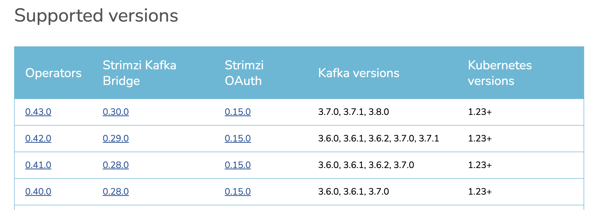

## Overview

Running [Kafka](https://kafka.apache.org/) on k8s can be done using i.e. [STRIMZI operator](https://strimzi.io/), which automates management of kafka nodes and other maintainance operations (i.e. rebalancing).

We want to upgrade Kafka cluster, from `3.7` to `3.8`

## Prerequirities

Temporary k8s cluster, where we will be simulating an upgrade and namespaces for kafka cluster and strimzi operator itself
```bash
kubectl create namespace kafka
kubectl create namespace strimzi-operator
```

### Deploy strimzi operator (with version which you want to upgrade)

Add helm repo
```bash
helm repo add strimzi https://strimzi.io/charts/
helm repo update strimzi
helm search repo strimzi-kafka-operator --versions
```

### Deploy strimzi operator

```bash
helm upgrade --install strimzi-operator \
  strimzi/strimzi-kafka-operator \
  --values values.yaml \
  --namespace strimzi-operator \
  --version 0.40.0 \
  --include-crds
```

Once we have strimzi operator deployed we can deploy kafka cluster. Deploy kafka cluster with Zookeeper (3 brokers + 3 zookeepers)

In this Kafka manifest we are not using specifically version, which defeaults to [latest](https://strimzi.io/docs/operators/latest/configuring#type-KafkaClusterSpec-schema-reference) for operator .

```yaml
apiVersion: kafka.strimzi.io/v1beta2
kind: Kafka
metadata:
  name: my-cluster
  namespace: kafka
spec:
  kafka:
    replicas: 3
    listeners:
      - name: plain
        port: 9092
        type: internal
        tls: false
      - name: tls
        port: 9093
        type: internal
        tls: true
    config:
      offsets.topic.replication.factor: 3
      transaction.state.log.replication.factor: 3
      transaction.state.log.min.isr: 2
      default.replication.factor: 3
      min.insync.replicas: 2
    storage:
      type: jbod
      volumes:
      - id: 0
        type: persistent-claim
        size: 10Gi
        deleteClaim: false
  zookeeper:
    replicas: 3
    storage:
      type: persistent-claim
      size: 10Gi
      deleteClaim: false
  entityOperator:
    topicOperator: {}
    userOperator: {}
```

## Upgrade procedure

If we want to upgrade Kafka we need to look first on versions compatibility matrix. If our operators supports version of kafka to which we want to upgrade, than we just need to upgrade `version` and `inter.broker.protocol.version` of `KafkaClusterSpec`. If operator doesn't support desired version, than we need to upgrade operator first.

Each version of operator support specific versions of kafka. Compatibility matrix can be found on [strimzi downloads](https://strimzi.io/downloads/) page.



Upgrade operator
```bash
helm upgrade --install strimzi-operator \
  strimzi/strimzi-kafka-operator \
  --values values.yaml \
  --namespace strimzi-operator \
  --version 0.43.0 \
  --include-crds
```

If in our kafka cluster we have defined version of kafka, i.e. Than after upgrading operator, we should bump `version` and `inter.broker.protocol.version` of `Kafka` object to desired version, compatible with supported versions by operator.

```yaml
apiVersion: kafka.strimzi.io/v1beta2
kind: Kafka
metadata:
  name: my-cluster
spec:
  kafka:
    version: 3.7.0
    ...
    config:
      ...
      inter.broker.protocol.version: "3.7"
```

## Docker images

Following docker images are used in deployment:

- operator `0.40`:
  - `quay.io/strimzi/kafka:0.40.0-kafka-3.7.0`
  - `quay.io/strimzi/operator:0.40.0`
- operator `0.43`:
  - `quay.io/strimzi/kafka:0.43.0-kafka-3.8.0`
  - `quay.io/strimzi/operator:0.43.0`

## Clean

Remove kafka (+ zookeeper) cluster and other strimzi related objects (i.e. kafka topics)

```bash
kubectl -n kafka delete $(kubectl get strimzi -o name -n kafka)
```

## Troubleshooting

- Check is kafka cluster is ready:

```bash
kubectl get kafka -w
NAME         DESIRED KAFKA REPLICAS   DESIRED ZK REPLICAS   READY   WARNINGS
my-cluster   3                        3
```

- Check the kafka cluster status for errors:

```bash
kubectl get kafka my-cluster -n kafka -o jsonpath='{.status.conditions}' -w
[{"lastTransitionTime":"2024-10-11T09:47:40.251289386Z","message":"Unsupported Kafka.spec.kafka.version: 3.6.0. Supported versions are: [3.7.0, 3.7.1, 3.8.0]","reason":"UnsupportedKafkaVersionException","status":"True","type":"NotReady"}]
```

- check operator logs

```bash
stern -l name=strimzi-cluster-operator -n strimzi-operator
```

- check version of kafka cluster from status

```bash
kubectl -n kafka get kafka my-cluster -o jsonpath='{.status.kafkaVersion}'
```

## Links

- [Operator versions](https://strimzi.io/downloads/)
- [Strimzi documentation](https://strimzi.io/documentation/)
- [KafkaClusterSpec](https://strimzi.io/docs/operators/latest/configuring#type-KafkaClusterSpec-schema-reference)
